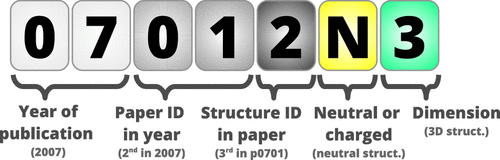

# CURATED-COFs
Clean, Uniform and Refined with Automatic Tracking from Experimental Database (CURATED) COFs *from literature*.

This repository contains original structures from literature search, with git-tracked corrections. \
DFT-optimized frameworks with DDEC charges are available on [Materials Cloud](https://www.materialscloud.org/discover/curated-cofs).

The database is built on top of the work of [Tong et al.](https://doi.org/10.1021/acs.jpcc.8b04742), named [CoRE-COF-DT280-v2.0](https://github.com/core-cof/CoRE-COF-Database/tree/2c1419d1f3c0d6eccce4306728cfe151c6b2ee08).

#### Structure labels

#### Cite as
*D. Ongari, A. V. Yakutovich, L. Talirz and B. Smit, Building a consistent and reproducible database for adsorption evaluation in Covalent-Organic Frameworks, ACS Central Science 2019, in press* ([10.1021/acscentsci.9b00619](https://doi.org/10.1021/acscentsci.9b00619))

#### Help us
Please report any missing COF structure or error by using [this form](https://forms.gle/gQpjcSEHjoJpqira8). Thank you!
